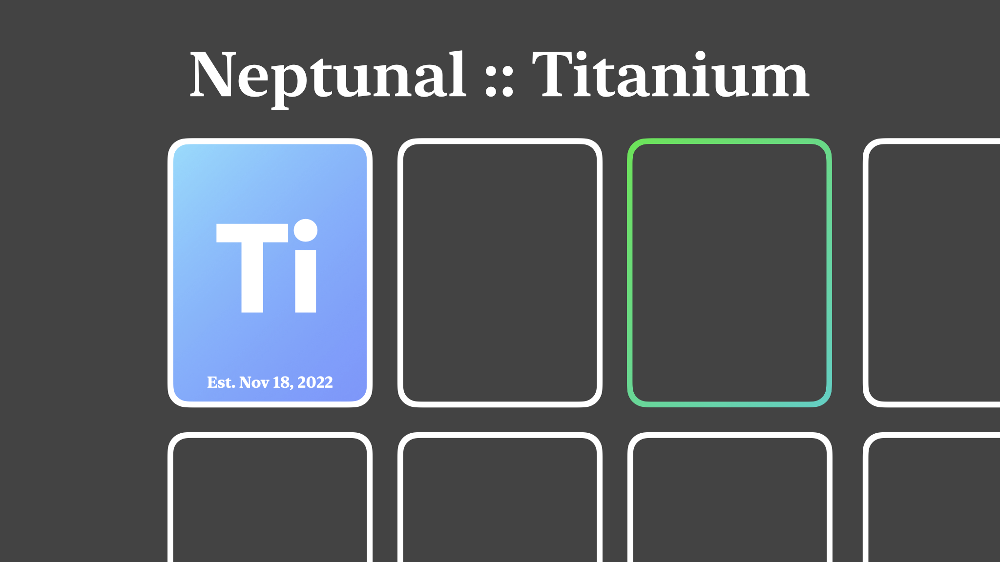

---

# **Titanium:** most based math interface

So we've all seen, like, TI-89 calculators, right?

Titanium is a Rust library with the goal of providing a bridge between mathemetical capability (see my math library, [Ferrum](https://github.com/nptnl/ferrum)) and user input. Titanium tokenizes, parses, and evaluates simple mathemetical expressions, and is intended to be extended to the full capabilities of Ferrum, along with support for variables, equation solving, and graphing.